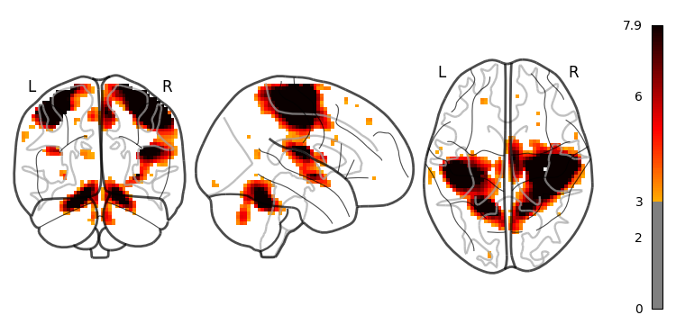

In this project we explore the dynamical systems of the brain and try to understand the mathematics behind it.

- [Data Modalities](#data-modalities)
- [Python packages](#python-packages)
- [Datasets](#datasets)
- [Exploratory Data Analysis: HCP Young Adult](#exploratory-data-analysis-hcp-young-adult)
- [Models](#models)
  - [1. Biophysical Models](#1-biophysical-models)
  - [2. Neural Mass Models](#2-neural-mass-models)
  - [3. Neural Field Models](#3-neural-field-models)
  - [4. Deep Learning-based Models](#4-deep-learning-based-models)
- [References](#references)

# Data Modalities

- MRI (Magnetic Resonance) - temporal ++ spatial resolution
  - Diffusion MRI (dMRI/DTI)
  - Functional MRI (fMRI)
  - resting-state fMRI (rfMRI)
  - task-fMRI (tfMRI)
- MEG (Magnetoencephalography): + temporal + spatial resolution
- EEG (Eloctroencephalography): + temporal - spatial resolution

# Python packages
- [nibabel](https://github.com/nipy/nibabel): read and write access to common neuroimaging file formats.
- [nilearn](https://github.com/nilearn/nilearn): versatile analyses of brain volumes and surfaces

# Datasets

| **Dataset**       | **Modalities**                      | **N (subjects)** | **Spatial Resolution**          | **Access**                           |
| :---------------- | :---------------------------------- | :--------------- | :------------------------------ | :----------------------------------- |
| HCP Young Adult   | T1/T2 MRI; DTI; resting/task fMRI   | \~1,200          | \~0.7 mm (T1), 2 mm fMRI        | Public (requires login/agreements)   |
| UK Biobank        | T1 MRI; T2 FLAIR; DTI; resting fMRI | \~100,000        | 1 mm (T1), 2–3 mm fMRI          | Public (application, approved users) |
| NKI-Rockland      | T1 MRI; DTI; resting fMRI           | \~1,000          | 1–2 mm (T1), 2–3 mm fMRI        | Public (INDI/NITRC; DUA)             |
| Cam-CAN           | T1 MRI; task/rest fMRI; MEG         | \~700            | 1 mm (T1); MEG \~5 mm eq. depth | Public (Cam-CAN repository)          |
| GSP (Superstruct) | T1 MRI; resting-state fMRI          | \~1,500          | \~1 mm (T1), 3.5 mm fMRI        | Restricted (Dataverse)               |

# Exploratory Data Analysis: HCP Young Adult
- Subjects: ~1,200 healthy adults
- Age Range: 22–35
- Family Structure: Includes twins and non-twin siblings
- Access: [ConnectomeDB](https://db.humanconnectome.org), requires user registration and agreement to data usage terms.

# Models

## 1. Biophysical Models

These model neurons and synapses at a detailed level:

- Hodgkin–Huxley model: Describes how action potentials in neurons are initiated and propagated.
- Morris–Lecar model: A simplified version of Hodgkin–Huxley, useful for studying oscillatory dynamics.
- FitzHugh–Nagumo model: Captures the essential features of excitability and spike generation.

## 2. Neural Mass Models

These describe the collective behavior of populations of neurons:

- Jansen–Rit model: Used to simulate EEG signals, often in the context of epilepsy or evoked potentials.
- Wendling model: Extends Jansen–Rit by modeling inhibitory subpopulations in more detail.
- Freeman–Kozma model: Describes chaotic dynamics of brain states.

## 3. Neural Field Models

These include spatial interactions among neural masses:

- Amari model: Describes pattern formation in neural fields [[2]](#References)
$$
\partial_t \psi(t,x) = -\psi(x,t) + \int_R \omega(x-x')f(\psi(t,x'))dx'
$$
- Wilson–Cowan model (spatial extension): Originally a neural mass model, but often extended to include spatial dynamics.
- Jirsa–Haken model (as in your image): A general neural field model used in TVB for simulating whole-brain dynamics [[1]](#references)
$$
\dot \psi(x_i, t) = L(\psi(x_i, t)) + \int_{\Gamma_l}g_{ij}S(\Psi(x_j, t-\tau_{ij}))dx_j + \int_{\Gamma_g}G_{ij}\eta_{ij}S(\Psi(x_j, t-\tau_{ij}))dx_j + \omega(t)
$$
  
## 4. Deep Learning-based Models

# References

[1] Huifang E Wang, Paul Triebkorn, Martin Breyton, Borana Dollomaja, Jean-Didier Lemarechal, Spase Petkoski, Pierpaolo Sorrentino, Damien Depannemaecker, Meysam Hashemi, Viktor K Jirsa, Virtual brain twins: from basic neuroscience to clinical use, National Science Review, Volume 11, Issue 5, May 2024, nwae079, https://doi.org/10.1093/nsr/nwae079

[2] Amari S.-i. Dynamics of pattern formation in lateral-inhibition type neural fields (1977) Biological Cybernetics, 27 (2), pp. 77 - 87, Cited 1584 times.
DOI: 10.1007/BF00337259